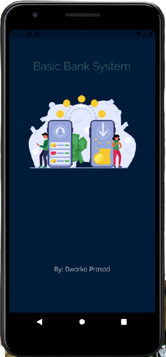
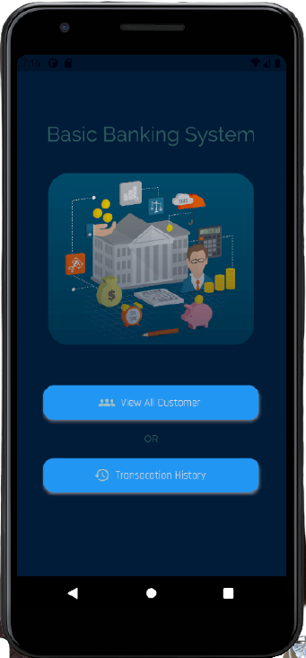
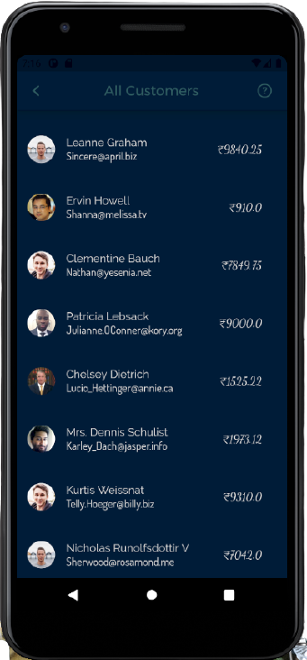
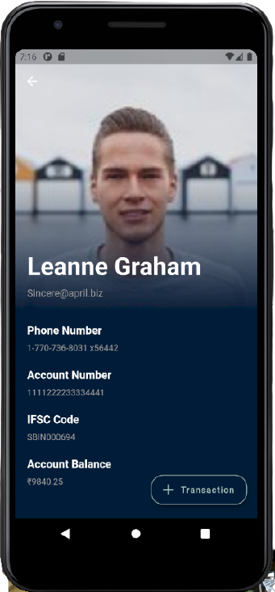
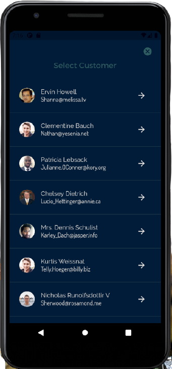
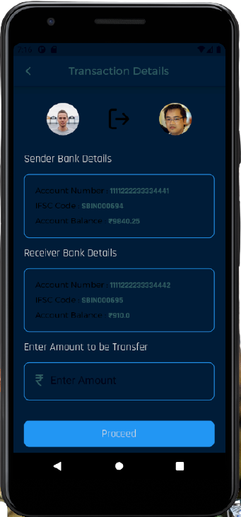
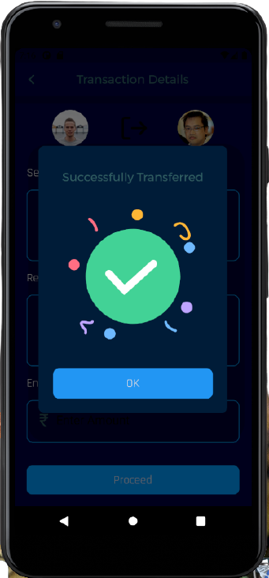
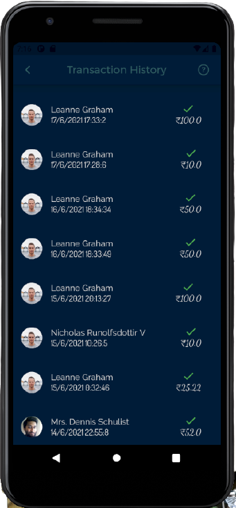
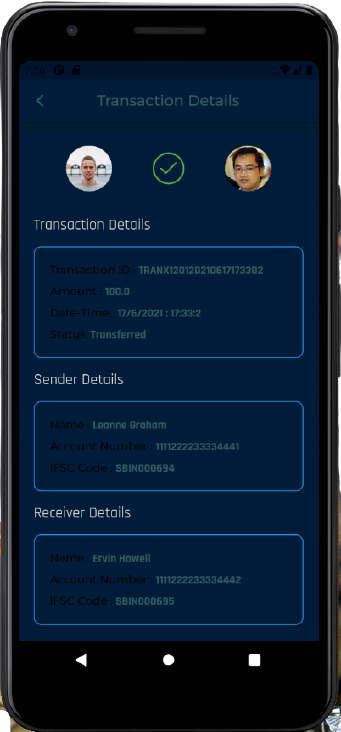

# `Basic-Banking-System`

## Project Details:

   * @Author : `Dwarka prasad Bairwa(1801061)`
   
   * Project Name : `Basic Banking System`

   * Requirements :
   
    1. Database Server : Firebase
    2. Client : Android/i-OS
    3. Development Tools : Android Studio , VS Code
    4. Programming Language : Dart
    5. SDK : Flutter
    
## Screen
 * splash Screen & Home Screen
 
   </img>
   </img>

 * Other Screens
 
   </img>
   </img>
   </img>
   </img>
   </img>
   </img>
   </img>

